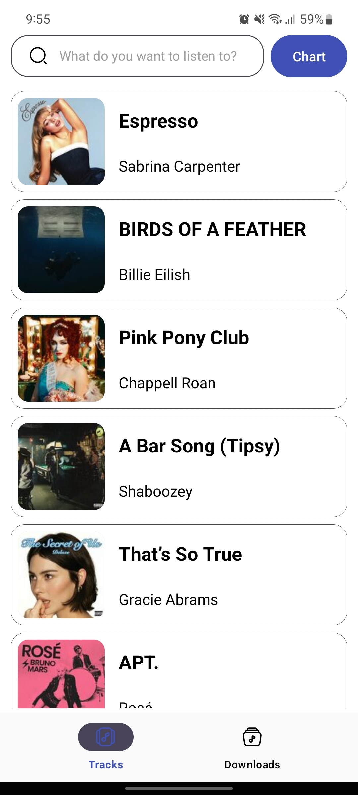
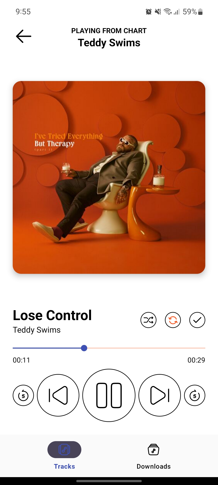
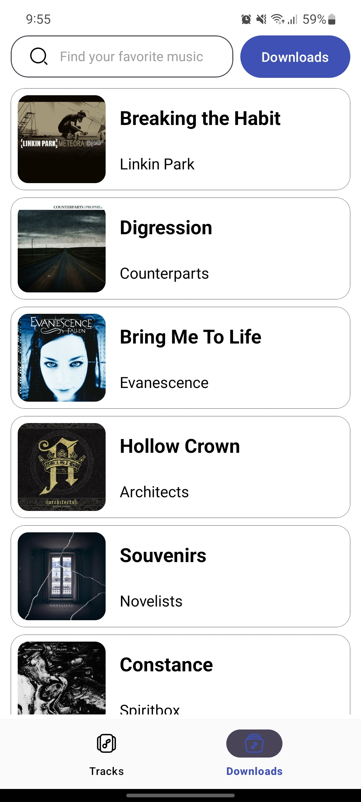

# Music Player

This is a music application that uses requests to the [Deezer Api](https://developers.deezer.com/api). 

The application allows users to:

- Search for tracks by keyword.
- Play tracks.
- Store track data in a local database.
- Download tracks to local storage for offline playback.

## Libraries

- [Kotlin](https://kotlinlang.org): programming language.
- [Coroutines](https://github.com/Kotlin/kotlinx.coroutines) + [Flow](https://kotlinlang.org/docs/flow.html): for asynchronous operations.
- [Kotlin Serialization](https://github.com/Kotlin/kotlinx.serialization): for data serialization.
- [Navigation Component](https://developer.android.com/guide/navigation): for navigating between screens.
- [Retrofit](https://github.com/square/retrofit): for making network requests.
- [Dagger](https://github.com/google/dagger): dependency injection framework.
- [Room](https://developer.android.com/training/data-storage/room): for storing downloaded tracks.
- [Paging](https://developer.android.com/topic/libraries/architecture/paging/v3-overview): for paginated data loading.
- [Glide](https://github.com/bumptech/glide): for loading and displaying images.
- Architecture
    - MVVM
    - Clean Architecture
    - Multi-module architecture

## Screenshots

    
    
    

